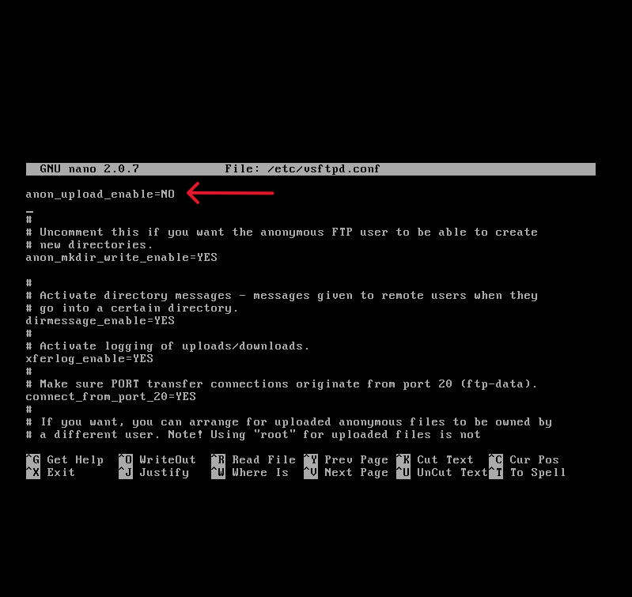

# Hardening Metasploitable-2 
Hello. In this article, we will perform a hardening process on Metasploitable 2, which contains many security vulnerabilities.

- You can see the security vulnerabilities I found in my Nmap scan below.
  

## FTP(21)
Let's start with FTP. FTP is a file transfer protocol used to transfer files between remote hosts. Metasploitable 2 runs vsftpd version 2.3.4, which is vulnerable to backdoor code execution. To fix this vulnerability, anonymous uploads must be disabled by setting anon_upload_enable=NO in the /etc/vsftpd.conf file. Additionally, since the backdoor is located on port 6200, traffic to port 6200 should be blocked, which can be done using the following iptables rules.

 
