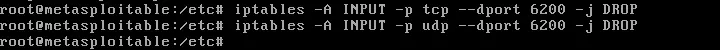

# Hardening Metasploitable-2 
Hello. In this article, we will perform a hardening process on Metasploitable 2, which contains many security vulnerabilities.

- You can see the security vulnerabilities I found in my Nmap scan below.
  

## FTP(21)
Let's start with FTP. FTP is a file transfer protocol used to transfer files between remote hosts. Metasploitable 2 runs vsftpd version 2.3.4, which is vulnerable to backdoor code execution. To fix this vulnerability, anonymous uploads must be disabled by setting anon_upload_enable=NO in the /etc/vsftpd.conf file. Additionally, since the backdoor is located on port 6200, traffic to port 6200 should be blocked, which can be done using the following iptables rules.




## Telnet,Rexec,Rlogin (23,512,513)
Telnet, Rexec, and Rlogin are remote access services. They allow users to execute commands and interact with remote hosts. Unfortunately, data is sent in plain text, which is dangerous because sensitive information such as passwords can be transmitted. Therefore, these services should be disabled. More secure alternatives such as SSH should be used, as they provide a level of encryption. Telnet, Rexec, and Rlogin can be disabled by going to /etc/inetd.conf and commenting out the telnet, shell, and login entries, respectively. 

 

## VNC (5900)

The VNC password for Metasploitable 2 is “password” funnily enough which makes it very easy to brute-force. The VNC password should be changed by using the command vncpasswd.

 

## SMB (139,445)
Samba, or SMB for short, is a file sharing service that allows users to access files and printer services on a network. Using MSF6, the exploit exploit/multi/samba/usermap_script gains root access to Metasploitable 2. If the line “username map script = /etc/samba/scripts/mapusers.sh” is commented out, the exploit may become ineffective.

 

 - This version of Samba (3.0.20) is affected by the Badlock vulnerability (CVE-2016–2118). The Badlock security vulnerability contained specially crafted requests that could trigger memory corruption issues or buffer overflow attacks, potentially leading to arbitrary code execution. The only way to fix this security vulnerability is to apply a patch to version 4.1x or higher.


## NFS (111,2049)

NFS, if you don't know what it is yet, is a file sharing service that allows users to mount remote file systems on their machines. In Metasploitable 2, NFS is misconfigured in such a way that it provides full access to the entire root file system on all devices on the network. As you can see from the following /etc/exports, ‘*’ essentially means that all hosts are allowed to mount the root file system, which is strongly discouraged. Limiting access to only the necessary hosts and only the necessary directories is considered best practice.


## Apache Tomcat AJP Connector (8009)
The AJP Connector facilitates communication between Tomcat and the installed web server which in this case is Apache. Its similar to that of a load balancer as it offload static rendering of web pages to the web server while directing dynamic java processing to Tomcat. This particular version of Tomcat installed on Metasploitable 2 is running a vulnerable AJP Connector. The Ghostcat vulnerability (CVE-2020–1938) allows an attacker to retrieve all files in the web application that can be reached with ServletContext.getResourceAsStream(). It also allows the attacker to process any file as JSP which coupled with remote file upload could lead to remote code execution. This vulnerability can be remediated by adding the following line to /etc/tomcat5.5/server.xml which provides a layer of authentication.

```<Connector port="8009" protocol="AJP/1.3" redirectPort="8443" address="YOUR_TOMCAT_IP_ADDRESS" secret="YOUR_TOMCAT_AJP_SECRET"/>```

## MySQL Database (3306)
MySQL is a database server running on Metasploitable 2 with weak configuration. It uses port 3306 by default. In this version, attackers can access MySQL without authentication due to vulnerabilities such as the root user having no password. This allows attackers to view, modify, and inject malicious SQL commands into the database. The security vulnerability can be mitigated by setting strong passwords and configuring ```bind-address=127.0.0.1.```


## PostgresSQL (5432)
Postgresql is an SQL database used to store data. A Meterpreter shell can be created using MSF6's linux/postgres/postgres_payload. To disable this exploit, the directory used to distribute the payload must be changed. This can be done by changing the data directory to something other than the default in /etc/postgresql/8.3/main/postgresql.conf.


- Furthermore, the password for the postgres user is postgres which should also be changed to a more secure password.

 

##  Bindshell(1524)
Due to the last line above ingreslock stream tcp nowait ```root /bin/bash bash -i```, potential bad actors can easily spawn a root shell using tools like Meterpreter and Netcat. This line needs to be removed or commented out to remove the backdoor vulnerability.

## UnrealIRCD (6697)
UnrealIRCD is a internet relay chat service that allows users to message each other by joining channels. (chat rooms) Unfortunately, the version of UnrealIRCD that is running on Metasploitable 2 has a built-in backdoor that is vulnerable to arbitrary code execution. In order to fix this vulnerability, UnrealIRCD should be uninstalled (risk avoidance) or re-downloaded from the companies website.

## Java RMI Service (1099)
Java RMI (Remote Method Invocation) enables a Java application to remotely access Java objects on another machine. This mechanism works with a client-server architecture and provides access through the rmiregistry service. The RMI service included in Metasploitable 2 is open to external connections without authentication. This allows attackers to upload specially crafted malicious Java objects to the target system. In particular, objects registered with the UnicastRemoteObject class can be made executable. This allows attackers to execute remote commands (RCE) on the target. This security vulnerability can be mitigated by restricting access to the RMI service to authorized networks only and enabling authentication/encryption (SSL/RMI Security Manager) layers.

 


- After each fix, Metasploitable 2 should be restarted for the change to persist.


 
