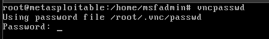
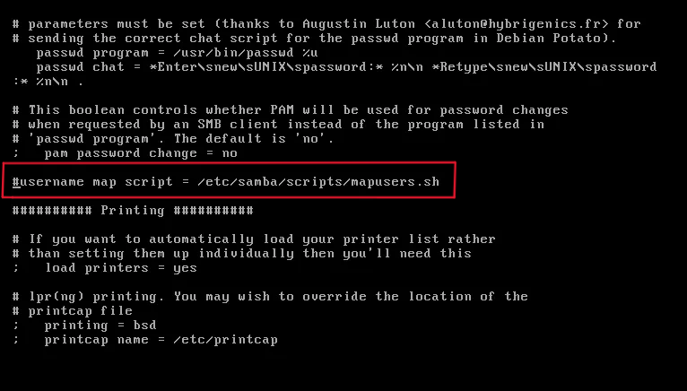
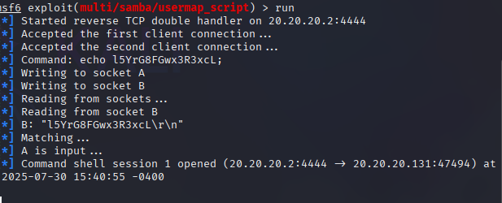

# Hardening Metasploitable-2 
Hello. In this article, we will perform a hardening process on Metasploitable 2, which contains many security vulnerabilities.

- You can see the security vulnerabilities I found in my Nmap scan below.
  

## FTP(21)
Let's start with FTP. FTP is a file transfer protocol used to transfer files between remote hosts. Metasploitable 2 runs vsftpd version 2.3.4, which is vulnerable to backdoor code execution. To fix this vulnerability, anonymous uploads must be disabled by setting anon_upload_enable=NO in the /etc/vsftpd.conf file. Additionally, since the backdoor is located on port 6200, traffic to port 6200 should be blocked, which can be done using the following iptables rules.

 

## Telnet,Rexec,Rlogin (23,512,513)
Telnet, Rexec, and Rlogin are remote access services. They allow users to execute commands and interact with remote hosts. Unfortunately, data is sent in plain text, which is dangerous because sensitive information such as passwords can be transmitted. Therefore, these services should be disabled. More secure alternatives such as SSH should be used, as they provide a level of encryption. Telnet, Rexec, and Rlogin can be disabled by going to /etc/inetd.conf and commenting out the telnet, shell, and login entries, respectively. 

 

## VNC (5900)

The VNC password for Metasploitable 2 is “password” funnily enough which makes it very easy to brute-force. The VNC password should be changed by using the command vncpasswd.

 

## SMB (139,445)
Samba, or SMB for short, is a file sharing service that allows users to access files and printer services on a network. Using MSF6, the exploit exploit/multi/samba/usermap_script gains root access to Metasploitable 2. If the line “username map script = /etc/samba/scripts/mapusers.sh” is commented out, the exploit may become ineffective.

 

 - This version of Samba (3.0.20) is affected by the Badlock vulnerability (CVE-2016–2118). The Badlock security vulnerability contained specially crafted requests that could trigger memory corruption issues or buffer overflow attacks, potentially leading to arbitrary code execution. The only way to fix this security vulnerability is to apply a patch to version 4.1x or higher.

## NFS (111,2049)

NFS, if you don't know what it is yet, is a file sharing service that allows users to mount remote file systems on their machines. In Metasploitable 2, NFS is misconfigured in such a way that it provides full access to the entire root file system on all devices on the network. As you can see from the following /etc/exports, ‘*’ essentially means that all hosts are allowed to mount the root file system, which is strongly discouraged. Limiting access to only the necessary hosts and only the necessary directories is considered best practice.

 
